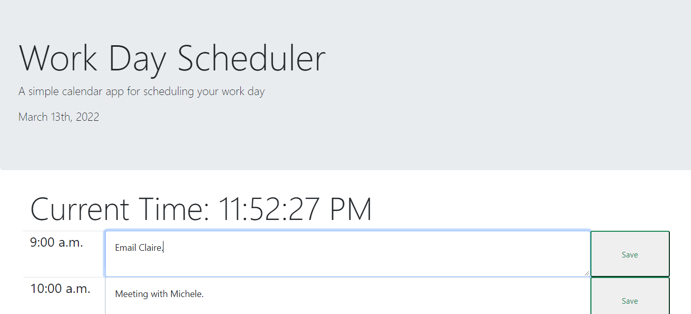

# Work Day Scheduler Starter Code

## Description 
The Work Day Scheduler allows users to input and track tasks that they would like to get done during the work day. This application logs the user's information so that if they were to exit out of the page, the event still remains in their respective timeblocks. The user can view the time as well as the current date.

## Table of Contents 
* [Website](#website)
* [Contributors](#contributors)
* [Credits](#credits)

## Website
Here is a link to the live website:
[Word Day Scheduler](https://vtori37.github.io/super-disco-main/)

## Author
[Victoria Rice](https://github.com/vtori37)

## Contributors
The following individuals helped to assist me in building this code:
* [Jamel James](https://github.com/jrj-sys)
* [Paul Soliz](https://github.com/ModiFir3)
* [Thomas "Xander" Hamilton](https://github.com/tsadiktalmudim)
* [Lucio Davila](https://github.com/Lucio-001)

## Credits
* HTML5
* CSS 
* JS
* Bootstrap
* Moment.js
--- 

